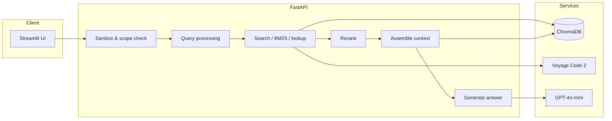
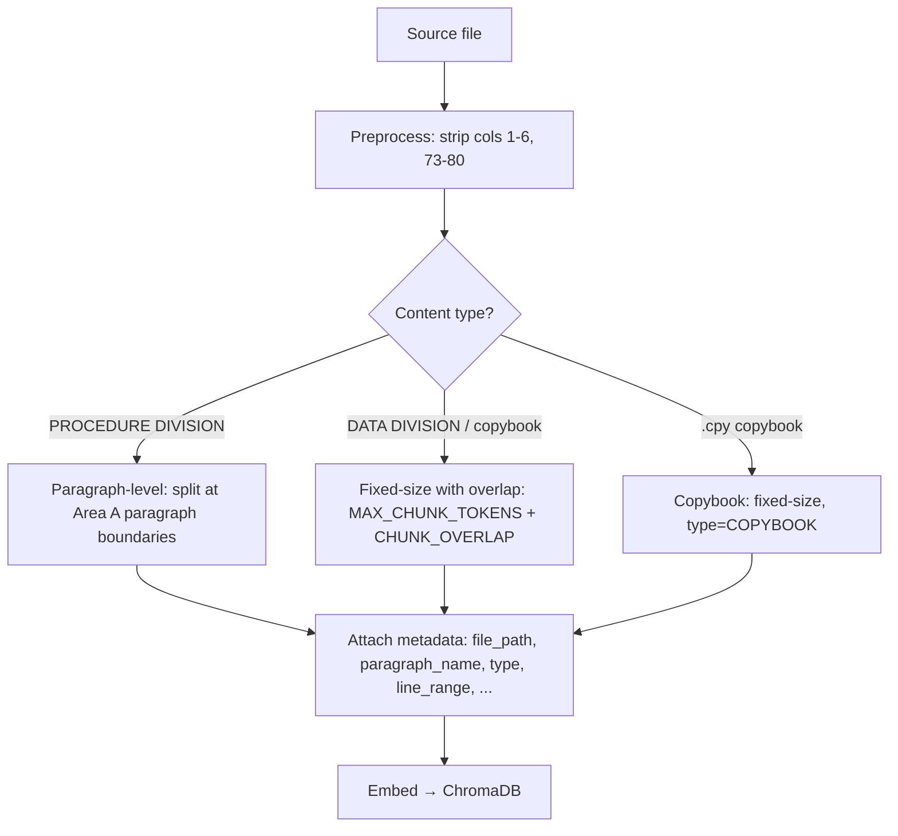
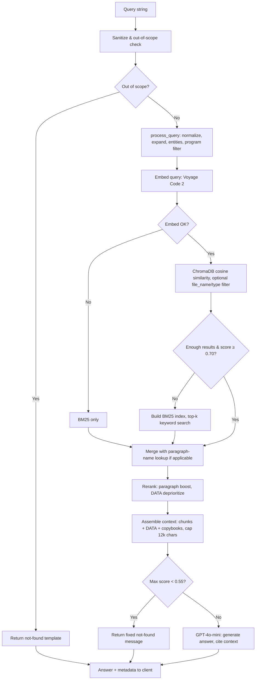

# LegacyLens RAG Architecture Document

**Project:** LegacyLens — RAG System for Legacy Enterprise Codebases  
**Target codebase:** OpenCOBOL Contrib (GnuCOBOL samples and utilities)  
**Document purpose:** 1–2 page breakdown of vector DB selection, embedding strategy, chunking, retrieval pipeline, failure modes, and performance results (per G4-Week-3-LegacyLens requirements).

---

## Architecture Overview

---

## 1. Vector DB Selection

**Choice: ChromaDB** (embedded / persistent client).

**Rationale:**

- **Simplicity and local dev:** ChromaDB’s Python API and persistent client (`PersistentClient`) allow a single process to ingest and query without a separate DB server. Collection path is configurable via `CHROMA_PERSIST_DIR` (default `./chroma_db`; e.g. `/data/chroma_db` on Railway) so data survives restarts and redeploys.
- **Cosine similarity:** Collection is created with `hnsw:space = "cosine"` to match the embedding model’s cosine similarity semantics.
- **Metadata filtering:** ChromaDB supports `where` filters on metadata (e.g. `file_name`, `type`, `paragraph_name`), which is used for program-scoped search and paragraph-name lookups.
- **Tradeoffs considered:** Pinecone/Weaviate were not chosen to avoid managed-service dependency and to keep the stack self-contained. pgvector was not chosen for MVP to reduce operational surface (no separate Postgres). ChromaDB’s `CHROMA_GET_ALL_LIMIT` (25,000 docs) is used when building the in-memory BM25 fallback index from the full document set.

**Security:** Filter inputs are validated via `sanitize_query_filters()` (whitelisted fields and `$and`/`$or` only); metadata is sanitized before storage and logging to avoid injection and path traversal.

---

## 2. Embedding Strategy

**Model: Voyage Code 2** (`voyage-code-2`), 1536 dimensions.

**Why it fits code understanding:**

- Code-optimized model, so COBOL paragraphs, PROCEDURE/DATA divisions, and identifiers are embedded in a representation that stays close for semantic search.
- 1536 dimensions balance quality and cost; same dimension size is used at ingestion and query time (no projection step).
- Batch embedding at ingestion uses `INGESTION_BATCH_SIZE` (128) and optional parallel workers (`EMBEDDING_BATCH_WORKERS`); single-query embedding at search uses a tight timeout (`QUERY_EMBED_TIMEOUT_SECONDS` = 10) so failures fail fast and trigger BM25 fallback.

**Zero-drop guarantee:** Chunks over `MAX_CHUNK_TOKENS` (500) are sub-split in the embedder via `_split_chunk_to_subchunks()` so no content is dropped; embeddings are generated for every sub-chunk. Exponential backoff (up to `MAX_RETRIES`) is used for Voyage API calls during ingestion.

---

## 3. Chunking Approach

**Strategy: syntax-aware, COBOL-specific, with fixed-size fallback.**

1. **Paragraph-level (primary)**  
   In the PROCEDURE DIVISION, chunks are split at COBOL paragraph boundaries. A paragraph is identified by Area A (cols 8–11 after preprocessing): an identifier of the form `NAME.` that is not a DIVISION/SECTION keyword. Each paragraph is one chunk; the paragraph header line is kept as the first line. Oversized paragraphs (> `MAX_CHUNK_TOKENS`) are sub-split with overlap while keeping `paragraph_name` on every sub-chunk.

2. **Section-level (secondary)**  
   Section headers (e.g. `SECTION_NAME SECTION`) are tracked; when a new section starts, the previous paragraph is flushed. Section context is later used in context assembly.

3. **Fixed-size with overlap (fallback)**  
   Used for DATA DIVISION, copybook body, and any content without clear paragraph boundaries. Chunk size is capped at `MAX_CHUNK_TOKENS` (500) with `CHUNK_OVERLAP_TOKENS` (50). Single lines that exceed the token limit are split into token-safe pseudo-lines so no content is dropped before embedding.

4. **Copybooks**  
   Files with extension `.cpy` are chunked with the same fixed-size strategy; every chunk is tagged `type=COPYBOOK` and `parent_section=COPYBOOK`.

**Metadata per chunk:** `file_path`, `file_name` (uppercase stem), `line_range`, `type` (PROCEDURE | DATA | COPYBOOK), `parent_section`, `paragraph_name`, `dependencies` (CALL/COPY/USING from reference_scraper), `comment_weight`, `dead_code_flag`, `file_hash`, `security_flag`. Preprocessing strips COBOL sequence (cols 1–6) and identification (73–80) and handles continuation and comment lines; comment text is not embedded.

**Ingestion pipeline (high level):**

---

## 4. Retrieval Pipeline

**End-to-end flow:** Query string → sanitize & out-of-scope check → **process_query** (normalize, expand terms, extract entities, intent, target_type) → **embed query** (Voyage Code 2) → **similarity search** (ChromaDB cosine, optional filters) → **BM25 fallback** when applicable → **paragraph-name metadata lookup** → **rerank** → **assemble_context** → **generate_answer**.

**Query processing:**  
- Normalization: lowercase, strip, collapse whitespace.  
- Entity extraction: COBOL-style identifiers (ALL-CAPS with hyphens).  
- Expansion: `QUERY_EXPANSION_TERMS` appends phrases for terms like "entry point", "dependencies", "file i/o", "error handling", "customer-record", "module-x", etc., to bias retrieval toward relevant PROCEDURE/DATA chunks.  
- Program detection: if the query contains a known program name from `PROGRAM_CATEGORIES`, a ChromaDB filter `file_name = <program>` is applied (with global fallback if no results).  
- Target type: when the query signals DATA or PROCEDURE intent, an optional `type` filter is applied (and relaxed if it yields no results).

**Similarity search:**  
ChromaDB `query_similar()` with configurable `top_k` (default 5; `TOP_K_COMPOUND` = 10 when multiple entities are detected). Results include `documents`, `metadatas`, and cosine distances converted to similarity scores as `1 - distance`.

**BM25 fallback:**  
If vector results are too few (< `BM25_FALLBACK_THRESHOLD` = 3) or max score is below `MIN_RELEVANCE_THRESHOLD` (0.70), an in-memory BM25 index is built from the full Chroma document set (up to `CHROMA_GET_ALL_LIMIT`) and top-k keyword results are returned. If query embedding fails (e.g. timeout), retrieval uses BM25 only. Environment variable `LEGACYLENS_RETRIEVAL_MODE` can force `bm25` or `vector_only` for evaluation.

**Paragraph-name lookup:**  
When the query contains paragraph/section signals and extracted entities, ChromaDB is queried by `paragraph_name` equality so that explicitly named paragraphs are always included even if vector/BM25 scores are low.

**Re-ranking:**  
Reranker adjusts scores: boost when `paragraph_name` matches query tokens (`RERANK_PARAGRAPH_BOOST_WEIGHT`), penalize DATA chunks for logic queries (`RERANK_DATA_DEPRIORITIZE_WEIGHT`), slight penalty for comment-heavy and dead-code chunks. Results are re-sorted by adjusted score descending.

**Context assembly:**  
For each reranked result, assembled context includes: parent section label, chunk text, DATA definitions for variables referenced in the chunk (from same file’s DATA chunks in Chroma), dependencies list, optional parent-section context chunks, and copybook content when COPY dependencies exist (resolve from repo root). Total assembled context is capped at `MAX_ASSEMBLED_CONTEXT_CHARS` (12,000). This gives the LLM both the matched chunk and related DATA/copybook context.

**Answer generation:**  
GPT-4o-mini with strict system prompt: cite only provided context, include "file path" and "line number" for found results, quote COBOL keywords verbatim, use "paragraph" when describing blocks, and return a structured "not found" (≥3 sentences) when the context does not support an answer. Fast-path: if max relevance score < `NOT_FOUND_SCORE_THRESHOLD` (0.55), the LLM is skipped and a fixed not-found message is returned. Out-of-scope queries (e.g. recipe, weather) get a dedicated template without calling search or LLM.

---

## 5. Failure Modes and Edge Cases

- **Low or no vector results:** Handled by BM25 fallback and, when applicable, paragraph-name metadata lookup. If both still miss (e.g. query names a non-existent paragraph), the answer generator returns a "not found" response with no hallucinated file/line.
- **Query embedding timeout/failure:** Retrieval switches to BM25-only; no crash.
- **Overly broad or ambiguous queries:** Query expansion and target_type (PROCEDURE/DATA) help, but some queries (e.g. "MODULE-X" when that name does not exist) are expanded toward dependency patterns; answer quality then depends on retrieval and on the system prompt’s not-found behaviour.
- **File I/O vs DATA Division:** Queries like "file i/o operations" are expanded to bias toward PROCEDURE chunks with OPEN/READ/WRITE; "FILE SECTION structured" is not over-expanded to avoid pulling in unrelated FD-only chunks and hurting other golden cases (handled via prompt instructions for FD quoting).
- **Program-scoped search with zero hits:** Filter is relaxed to global search, then BM25 if needed.
- **Chunk type filter too strict:** If filtering by `type=PROCEDURE` or `type=DATA` yields no results, the type filter is dropped and a second vector query is run.
- **Ingestion:** Insertion into ChromaDB is verified by comparing collection count before/after; a mismatch fails the pipeline so a partial index is never accepted silently.

---

## 6. Performance Results

**Metrics (from eval run 20260305T045022Z, 20 golden queries):**

| Metric | Result | Target (G4) |
|--------|--------|-------------|
| Retrieval precision (top-5) | 12/20 (60%) | >70% |
| Answer faithfulness | 19/20 (95%) | >70% |
| Latency gate (12 s) | FAIL (6 queries exceeded) | <3 s per query (stretch: 12 s gate) |

**Latency:** Six queries exceeded the 12 s gate (e.g. ll-004, ll-006, ll-008, ll-009, ll-013, ll-017); causes include embedding + retrieval + context assembly + LLM for heavier context and compound queries.

**Retrieval failures (examples):**  
- ll-001: main entry point for star_trek (ctrek.cob) not in top-5.  
- ll-002: UPDATE-RECORD / ADD-RECORD (cust01.cbl) missing.  
- ll-004: file I/O in presql2.cbl missing.  
- ll-009: mmapmatchfile.cbl FILE SECTION chunk missing.  
- ll-011: paragraph ST04-00 (gctestrun2.cbl) missing.  
- ll-013: cobweb-gtk.cob not in top-5.

**Answer failures:** ll-005 (answer missing "CALL", "dependency") — retrieval passed but LLM did not satisfy citation rules.

**Ingestion:** Pipeline runs file discovery → preprocess + chunk → dependency attachment → embed (batched) → ChromaDB insert with verification. Target: 10,000+ LOC in &lt;5 minutes; chunk and token distribution are logged in `ingestion_coverage_*.json` and `ingestion_timing_*.json` under `tests/results/`.

**Summary:** Embedding (Voyage Code 2) plus ChromaDB with paragraph-level chunking, query expansion, program-aware and type-aware filters, BM25 fallback, and paragraph-name lookup yield reasonable answer faithfulness. Retrieval precision and latency remain below targets on some golden queries; ongoing work focuses on chunk boundaries for specific files/paragraphs and on reducing end-to-end latency (caching, smaller context, or model/parameter tuning).
